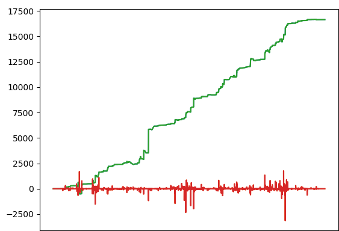

# Pair Trading - Reinforcement Learning - with Oanda Trading API

  

A TensoFlow implemention in Reinforcement Learning and Pairs Trading. The current status of the project covers implementation of RL in cointegration pair trading based on 1-minute stock market data. For the Reinforcement Learning here we use the N-armed bandit approach. The code is expandable so you can plug any strategies, data API or machine learning algorithms into the tool if you follow the style.

## Guidance
* [Medium](https://medium.com/@wai_i/a-gentle-implementation-of-reinforcement-learning-in-pairs-trading-6cdf8533bced) - The corresponding article for this project.

## Data Source
* [HistData](https://www.histdata.com/) - Run 'python formater_piphist.py' (EXAMPLE/Symphoenix) after modifying 'symbol = USDCAD' to match the one you want to retrieve data from (covers 2019).

## Examples
See the folder EXAMPLE for more details. Please initiate your own virtual environment and move the scripts you want to the root folder before running them.

## Idea of Usage
Start by retrieving data for EURJPY and GBPJPY by running 'formater_piphist.py' with the correct 'symbol' setting. Train a model with 'Training_Model.py' after editing the first two lines of the 'Read prices' section (lines 23-24) to match the data you have just downloaded. Edit 'CONFIG/config_trading.yml' with your personal ids and tokens. Start trading the 2 pairs by running 'Trading_Model.py'. That's all !

## Going Deeper...
* You can download multiple pairs historical data and run 'Analysis.py' to explore correlation and cointegration values and graphs.
* By running 'Training_Model.py', you get a backtest result at the end which allows tuning strategies.

  

## Disclaimer
The article and the relevant codes and content are purely informative and none of the information provided constitutes any recommendation regarding any security, transaction or investment strategy for any specific person. The implementation described in the article could be risky and the market condition could be volatile and differ from the period covered above. All trading strategies and tools are implemented at the users’ own risk.
